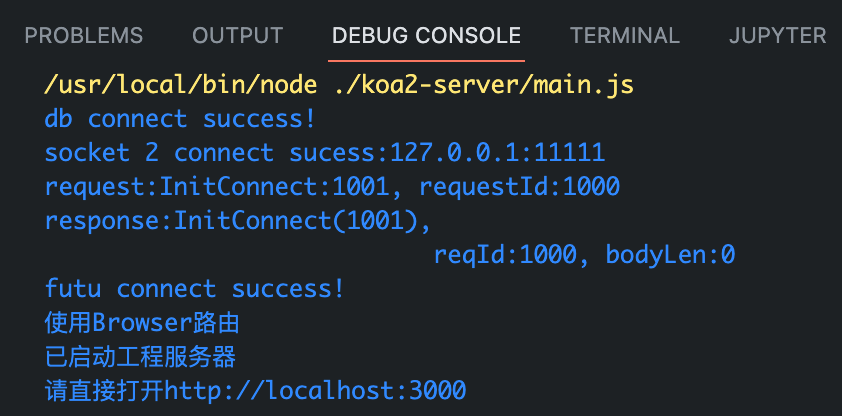
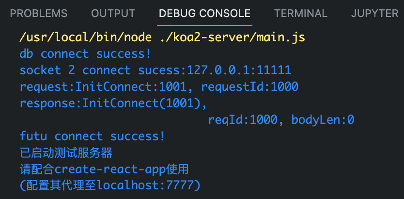
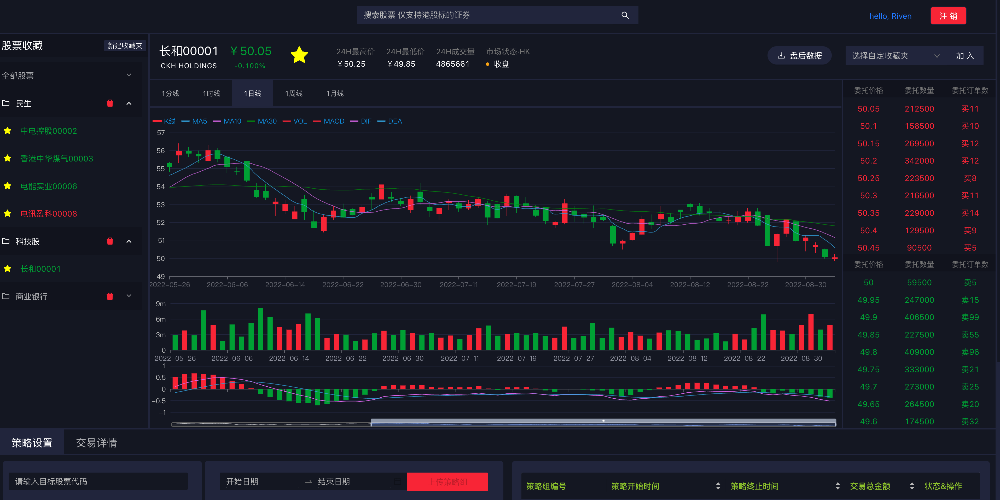

## 1. 安装说明
### 1.1 安装FutuOpenD

* 在<a href="https://www.futunn.com/download/OpenAPI" target="_blank">官方页面</a>下载该软件，推荐5.11.2308版本。
* 按照<a href="https://openapi.futunn.com/futu-api-doc/opend/opend-cmd.html" target="_blank">官方文档</a>进行配置。在编辑配置文件`FutuOpenD.xml`时，建议使用本仓库中的` /doc/FutuOpenD.xml`进行覆盖，并将`<login_account>`和`<login_pwd_md5>`字段对应的值替换成自己的用户名和md5加密后的密码。
* 以**命令行的形式**启动FutuOpenD。

### 1.2 安装MongoDB

* 在<a href="https://www.mongodb.com/try/download/enterprise" target="_blank">官方页面</a>下载该软件，推荐5.0.7以上版本。

* 启动MongoDB，**请不要修改任何默认配置参数**。

* 创建一个名为`test`的数据库，并在该数据库中创建名为`sessions`、`stars`、`users`的三张表（collection）。

### 1.3 配置部署环境

* 在<a href="https://nodejs.org/zh-cn/download/" target="_blank">官方页面</a>下载Node.js，推荐v16.16.0以上版本，并安装。

* 使用VSCode打开本仓库所示源码，并在Terminal中运行`npm install`。等待所有依赖包完成安装。

* 按F5启动服务器程序，按照**DEBUG CONSOLE**中的提示进行后续操作。

### 1.4 模式选择

* 服务器程序包含**测试模式**和**工程模式**，默认使用工程模式。

* 可以在本仓库中`/koa2-server/main.js`文件的末尾，根据注释修改服务器程序的启动模式。

* 工程模式包括打包后的前端资源，可按**DEBUG CONSOLE**中的提示直接在浏览器中打开。

  

* 测试模式是为了搭配前端开发环境，需启动<a href="https://github.com/RivendareChen/quant-frontend" target="_blank">前端工程</a>。
  

## 2. 错误排查

### 2.1 服务器启动失败后必须做的事

* 如果程序没有自动关闭，请手动关闭程序。因为本程序中的Socket类将会在与FutuOpenD连接失败后，每5s进行一次重连。

* 在关闭FutuOpenD时，尽量用shell命令杀死进程。不然可能会出现FutuOpenD已经关闭但是相应端口依然占用的情况。

### 2.2 可能出现的错误

* FutuOpenD、MongoDB等依赖软件没有启动或连接端口不匹配。

* FutuOpenD的API推送协议格式选择了json而非protobuf（因此再次建议用覆盖的方式修改`FutuOpenD.xml`）。

* 富途平台注册的账户权限不够、端口占用等情况。

## 3. 运行效果

